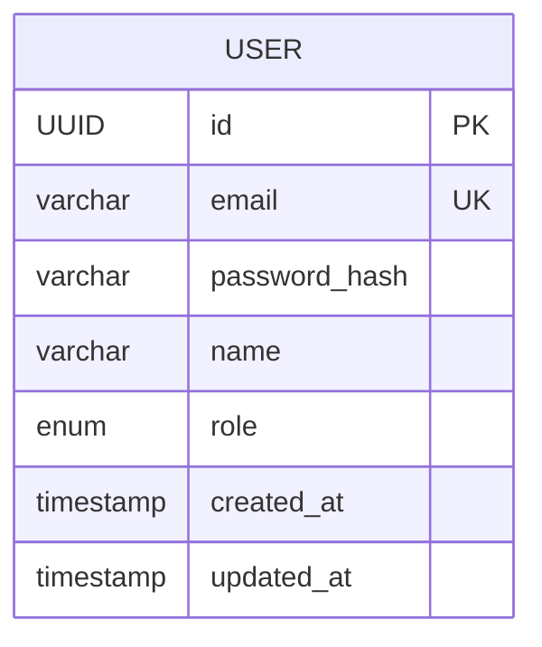
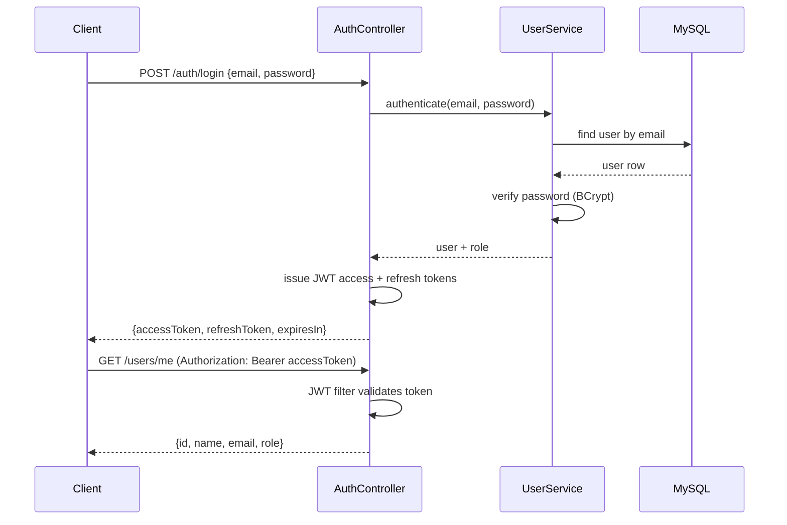

# Module 1 — Users & Authentication: Design

## Entity design

Notes:
- `id` uses the shared kernel's `BaseEntity` UUID convention
- `email` has a unique constraint enforced at the database level (Flyway
  migration), not just application-layer validation
- `role` is stored as a string enum: `STUDENT`, `INSTRUCTOR`, `ADMIN`

## API contract

| Method | Path | Auth | Request body | Response body | Status |
|---|---|---|---|---|---|
| POST | `/api/v1/users/register` | none | `{name, email, password}` | `{id, name, email, role, createdAt}` | 201 |
| POST | `/api/v1/auth/login` | none | `{email, password}` | `{accessToken, refreshToken, expiresIn}` | 200 |
| POST | `/api/v1/auth/refresh` | none (refresh token in body) | `{refreshToken}` | `{accessToken, refreshToken, expiresIn}` | 200 |
| GET | `/api/v1/users/me` | Bearer token | — | `{id, name, email, role}` | 200 |

All error responses use the shared `ApiError` shape from the common kernel:
`timestamp`, `status`, `error`, `message`, `path`, `details`.

## Authentication flow

## Open questions carried into implementation

- Refresh token rotation vs. reuse on refresh — decided in chapter 4
- Exact access/refresh token expiry values — decided in chapter 4
