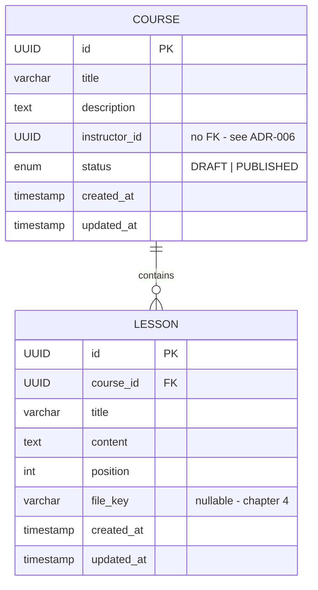
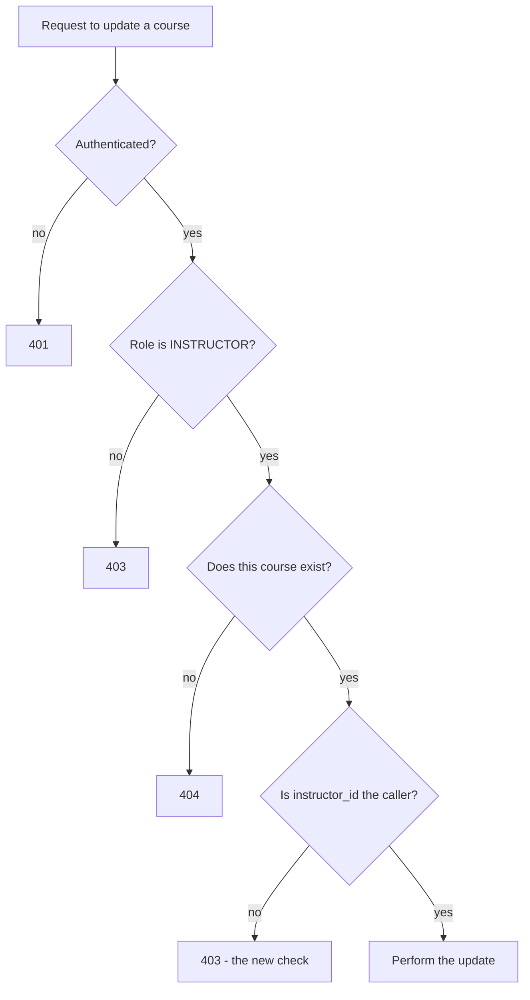

# Module 2 — Course Management: Design

## Entity design

Notes:
- Both extend the shared kernel's `BaseEntity`, so `id`, `created_at` and
  `updated_at` come for free - same as `User` in module 1.
- `LESSON` to `COURSE` is an ordinary JPA `@ManyToOne`: both live inside the
  `course` module, so no boundary is crossed.
- `COURSE.instructor_id` is a plain UUID with **no foreign key** to `users`.
  That's deliberate, and the reasoning is in ADR-006.
- `position` makes lesson order explicit rather than relying on insertion
  order, which JPA does not guarantee.

## API contract

| Method | Path | Auth | Request | Response | Status |
|---|---|---|---|---|---|
| POST | `/api/v1/courses` | INSTRUCTOR | `{title, description}` | `CourseResponse` | 201 |
| GET | `/api/v1/courses` | none | `?page&size` | `Page<CourseSummary>` | 200 |
| GET | `/api/v1/courses/{id}` | none* | — | `CourseDetail` | 200 |
| GET | `/api/v1/courses/me` | INSTRUCTOR | `?page&size` | `Page<CourseSummary>` | 200 |
| PUT | `/api/v1/courses/{id}` | owner | `{title, description, status}` | `CourseResponse` | 200 |
| DELETE | `/api/v1/courses/{id}` | owner | — | — | 204 |
| POST | `/api/v1/courses/{id}/lessons` | owner | `{title, content, position}` | `LessonResponse` | 201 |
| PUT | `/api/v1/courses/{id}/lessons/{lessonId}` | owner | `{title, content, position}` | `LessonResponse` | 200 |
| DELETE | `/api/v1/courses/{id}/lessons/{lessonId}` | owner | — | — | 204 |
| POST | `/api/v1/courses/{id}/lessons/{lessonId}/file` | owner | multipart | `LessonResponse` | 200 |

\* A `DRAFT` course returns `404` to anyone who isn't its owner.

All responses use the shared kernel's `ApiResponse` / `ApiError` envelopes.

## Two levels of authorization

Module 1 only ever asked *what kind of user is this*. This module adds a
second question that role checks cannot answer.

The first three checks are Module 1 territory - the filter chain and a role
rule handle them. Only the last one is new, and it cannot be expressed as a
URL rule, because whether access is allowed depends on the specific row
being touched, not on the path.

Skipping that final check is the vulnerability class known as an **insecure
direct object reference (IDOR)**: any instructor could edit any course
simply by changing the id in the URL.

## Cross-module lookup

Course data holds `instructor_id` only. To show an instructor's name, the
`course` module calls the `user` module's public service interface, which
returns a DTO - never a `User` entity.

Done naively, listing 20 courses means 20 separate instructor lookups. The
fix is a batch lookup - collect the distinct instructor IDs from the page,
ask once, and map the results back. Introduced in chapter 2, where it first
becomes visible.

## Open questions carried into implementation

- File storage target - local disk or cloud object storage (chapter 4)
- Whether deleting a course should soft-delete once enrolments exist
  (Module 3 may revisit; hard delete for now)
