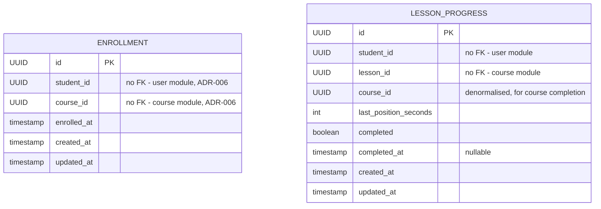
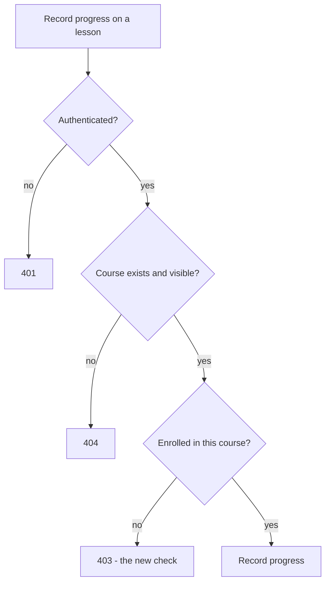
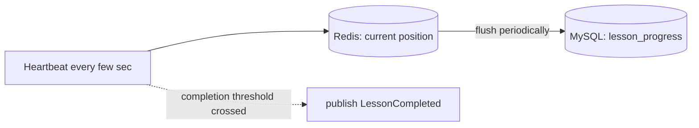

# Module 3 — Enrollment & Progress: Design

## Entity design

Notes:
- Both extend `BaseEntity`, so id and timestamps come for free.
- **No foreign keys at all.** Every reference crosses a module boundary -
  student and lesson and course all live in other modules - so all are plain
  UUIDs resolved through public interfaces (ADR-006). This module is the
  purest example of the boundary rule in the whole series.
- `LESSON_PROGRESS` is deliberately **not** tied to `ENROLLMENT`. It is keyed
  by student + lesson and lives independently, which is what lets progress
  survive an unenrol/re-enrol cycle (US-3).
- `course_id` is denormalised onto progress so course completion is a single
  query, not a walk from lesson back up to course.
- Uniqueness: one enrolment per (student, course); one progress row per
  (student, lesson). Both enforced by a unique constraint.

## API contract

| Method | Path | Auth | Request | Response | Status |
|---|---|---|---|---|---|
| POST | `/api/v1/enrollments` | authenticated | `{courseId}` | `EnrollmentResponse` | 201 |
| GET | `/api/v1/enrollments/me` | authenticated | `?page&size` | `Page<EnrollmentResponse>` | 200 |
| DELETE | `/api/v1/enrollments/{courseId}` | enrolled student | — | — | 204 |
| PUT | `/api/v1/courses/{courseId}/lessons/{lessonId}/progress` | enrolled student | `{positionSeconds}` | `ProgressResponse` | 200 |
| GET | `/api/v1/courses/{courseId}/lessons/{lessonId}/progress` | enrolled student | — | `ProgressResponse` | 200 |
| GET | `/api/v1/courses/{courseId}/progress` | enrolled student | — | `CourseProgressResponse` | 200 |

All responses use the shared `ApiResponse` / `ApiError` envelopes. The PUT
progress endpoint is the heartbeat - called repeatedly while a lesson plays.

## Three levels of authorization, now

Each module has added a new question the previous one couldn't answer.

- Module 1: *what kind of user are you* (role).
- Module 2: *is this yours* (ownership).
- Module 3: *are you enrolled in this* (membership) - the new one.

Membership cannot be expressed as a role or a URL rule; it depends on whether
a row exists in the enrolment table for this student and course.

## The write-frequency problem, and the fix

A "done / not done" model writes once per lesson. Resume-position is different:
the client sends the current position every few seconds while playing. Written
naively, one video watch is hundreds of MySQL writes.

The current position lives in Redis - cheap to overwrite constantly. A
periodic flush (and the flush on pause/leave) persists it to MySQL. MySQL
sees a trickle of writes instead of a storm. This is ADR-009, and it is where
Redis - listed in the stack since Module 1 - finally earns its place. The
naive all-MySQL version is built first in chapter 4 so the problem is felt
before chapter 5 solves it.

## Events

Introduced with Spring's `ApplicationEventPublisher` - in-process, no Kafka
yet (ADR-010).

| Event | Published when | Example listener (this module) |
|---|---|---|
| `StudentEnrolled` | enrolment succeeds | logs "welcome email would go here" |
| `LessonCompleted` | watched position first crosses 90% | logs "progress milestone" |

The point being taught is decoupling: `enroll()` saves the row and publishes
`StudentEnrolled`, then returns. It does not know who listens. When Kafka
arrives in Module 7, the same events travel across a network to other
services - the mental model is already in place.

## Cross-module reads needed

- Is a course published, and does it exist? → course module's public interface
- How many lessons does a course have (for completion %)? → course module's
  public interface
- Lesson length in seconds (for the 90% threshold)? → course module's public
  interface (lesson metadata)

Each is a reason to widen the course module's public interface slightly,
which is itself a teachable point: the interface grows deliberately, in
response to a real need from another module.

## Open questions carried into implementation

- Redis flush cadence (time-based, e.g. every 30s, vs count-based) - decided
  in chapter 5
- Whether course-completion % is computed on read or cached - start with
  on-read, revisit only if it proves slow
